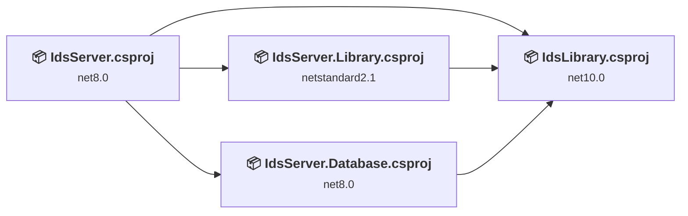
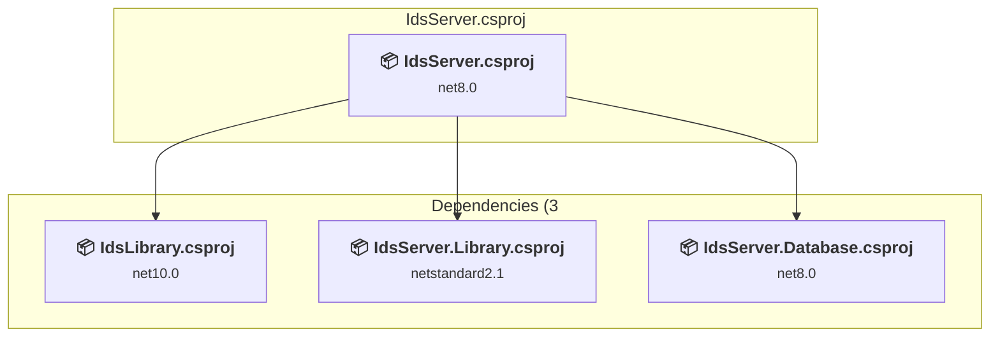
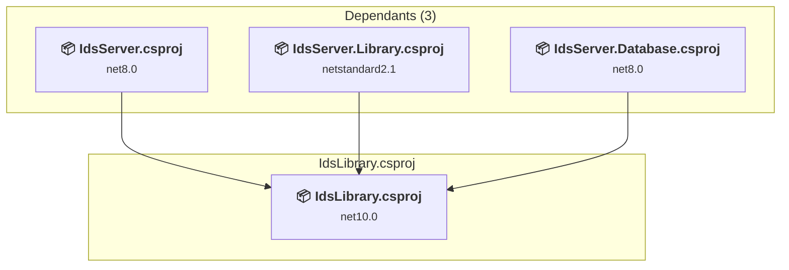
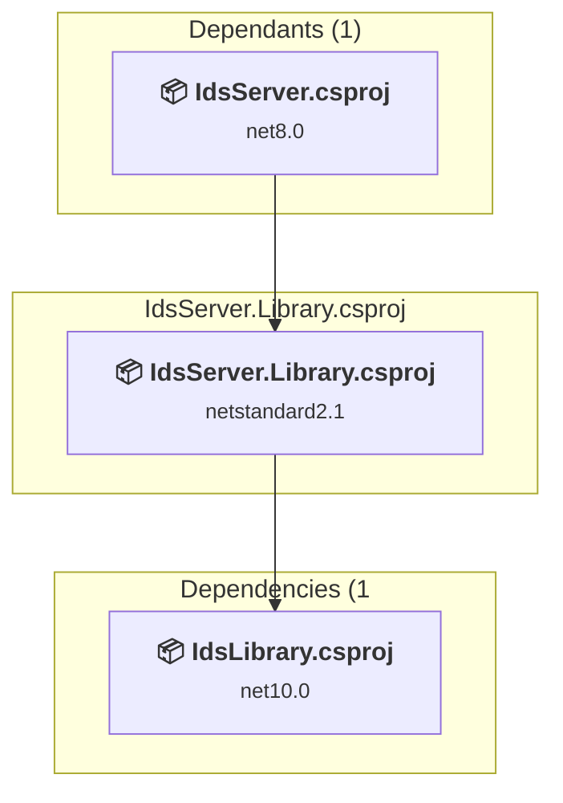
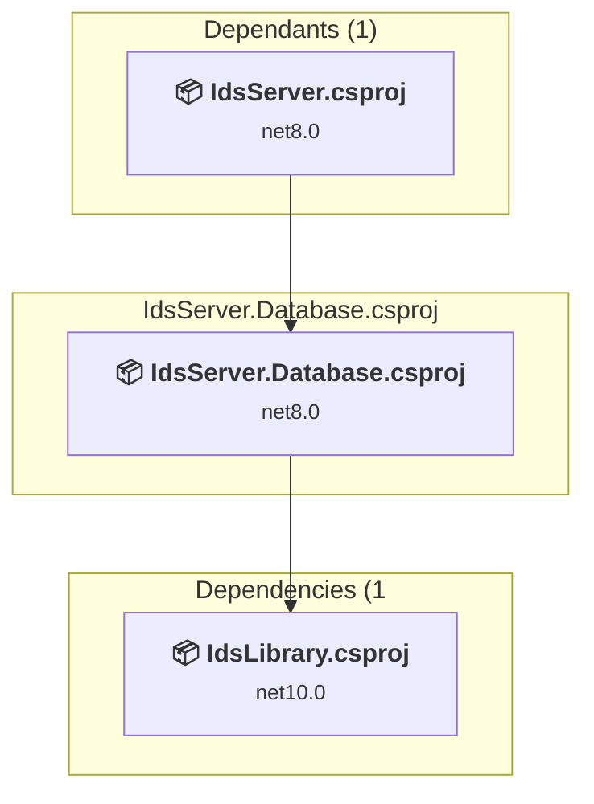

# Projects and dependencies analysis

This document provides a comprehensive overview of the projects and their dependencies in the context of upgrading to .NETCoreApp,Version=v10.0.

## Table of Contents

- [Executive Summary](#executive-Summary)
  - [Highlevel Metrics](#highlevel-metrics)
  - [Projects Compatibility](#projects-compatibility)
  - [Package Compatibility](#package-compatibility)
  - [API Compatibility](#api-compatibility)
- [Aggregate NuGet packages details](#aggregate-nuget-packages-details)
- [Top API Migration Challenges](#top-api-migration-challenges)
  - [Technologies and Features](#technologies-and-features)
  - [Most Frequent API Issues](#most-frequent-api-issues)
- [Projects Relationship Graph](#projects-relationship-graph)
- [Project Details](#project-details)

  - [IdsServer.csproj](#idsservercsproj)
  - [X:\workspaces\dtcrssmd\IDS\Library\IdsLibrary\IdsLibrary.csproj](#x:workspacesdtcrssmdidslibraryidslibraryidslibrarycsproj)
  - [X:\workspaces\dtcrssmd\IDS\Library\IdsServer.Library\IdsServer.Library.csproj](#x:workspacesdtcrssmdidslibraryidsserverlibraryidsserverlibrarycsproj)
  - [X:\workspaces\dtcrssmd\IDS\Server\IdsServer.Database\IdsServer.Database.csproj](#x:workspacesdtcrssmdidsserveridsserverdatabaseidsserverdatabasecsproj)

## Executive Summary

### Highlevel Metrics

| Metric | Count | Status |
| :--- | :---: | :--- |
| Total Projects | 4 | 1 require upgrade |
| Total NuGet Packages | 18 | 2 need upgrade |
| Total Code Files | 56 |  |
| Total Code Files with Incidents | 5 |  |
| Total Lines of Code | 6028 |  |
| Total Number of Issues | 8 |  |
| Estimated LOC to modify | 5+ | at least 0,1% of codebase |

### Projects Compatibility

| Project | Target Framework | Difficulty | Package Issues | API Issues | Est. LOC Impact | Description |
| :--- | :---: | :---: | :---: | :---: | :---: | :--- |
| [IdsServer.csproj](#idsservercsproj) | net8.0 | 🟢 Low | 2 | 5 | 5+ | AspNetCore, Sdk Style = True |
| [X:\workspaces\dtcrssmd\IDS\Library\IdsLibrary\IdsLibrary.csproj](#x:workspacesdtcrssmdidslibraryidslibraryidslibrarycsproj) | net10.0 | ✅ None | 0 | 0 |  | ClassLibrary, Sdk Style = True |
| [X:\workspaces\dtcrssmd\IDS\Library\IdsServer.Library\IdsServer.Library.csproj](#x:workspacesdtcrssmdidslibraryidsserverlibraryidsserverlibrarycsproj) | netstandard2.1 | ✅ None | 0 | 0 |  | ClassLibrary, Sdk Style = True |
| [X:\workspaces\dtcrssmd\IDS\Server\IdsServer.Database\IdsServer.Database.csproj](#x:workspacesdtcrssmdidsserveridsserverdatabaseidsserverdatabasecsproj) | net8.0 | ✅ None | 0 | 0 |  | ClassLibrary, Sdk Style = True |

### Package Compatibility

| Status | Count | Percentage |
| :--- | :---: | :---: |
| ✅ Compatible | 16 | 88,9% |
| ⚠️ Incompatible | 0 | 0,0% |
| 🔄 Upgrade Recommended | 2 | 11,1% |
| ***Total NuGet Packages*** | ***18*** | ***100%*** |

### API Compatibility

| Category | Count | Impact |
| :--- | :---: | :--- |
| 🔴 Binary Incompatible | 1 | High - Require code changes |
| 🟡 Source Incompatible | 0 | Medium - Needs re-compilation and potential conflicting API error fixing |
| 🔵 Behavioral change | 4 | Low - Behavioral changes that may require testing at runtime |
| ✅ Compatible | 2245 |  |
| ***Total APIs Analyzed*** | ***2250*** |  |

## Aggregate NuGet packages details

| Package | Current Version | Suggested Version | Projects | Description |
| :--- | :---: | :---: | :--- | :--- |
| Ardalis.SmartEnum | 8.2.0 |  | [IdsLibrary.csproj](#x:workspacesdtcrssmdidslibraryidslibraryidslibrarycsproj) | ✅Compatible |
| AutoMapper | 16.1.1 |  | [IdsServer.csproj](#idsservercsproj) | ✅Compatible |
| DevExtreme.AspNet.Core | 24.1.3 |  | [IdsServer.csproj](#idsservercsproj) | ✅Compatible |
| DevExtreme.AspNet.Data | 5.0.0 |  | [IdsServer.csproj](#idsservercsproj) | ✅Compatible |
| FluentValidation | 11.11.0 |  | [IdsLibrary.csproj](#x:workspacesdtcrssmdidslibraryidslibraryidslibrarycsproj) [IdsServer.csproj](#idsservercsproj) | ✅Compatible |
| FluentValidation.DependencyInjectionExtensions | 11.11.0 |  | [IdsServer.csproj](#idsservercsproj) | ✅Compatible |
| Hellang.Middleware.ProblemDetails | 6.5.1 |  | [IdsServer.csproj](#idsservercsproj) | ✅Compatible |
| JetBrains.Annotations | 2024.3.0 |  | [IdsServer.csproj](#idsservercsproj) | ✅Compatible |
| MediatR | 12.4.1 |  | [IdsServer.csproj](#idsservercsproj) | ✅Compatible |
| Microsoft.EntityFrameworkCore | 9.0.1 |  | [IdsServer.Database.csproj](#x:workspacesdtcrssmdidsserveridsserverdatabaseidsserverdatabasecsproj) | ✅Compatible |
| Microsoft.EntityFrameworkCore.Design | 9.0.1 | 10.0.8 | [IdsServer.csproj](#idsservercsproj) [IdsServer.Database.csproj](#x:workspacesdtcrssmdidsserveridsserverdatabaseidsserverdatabasecsproj) | NuGet package upgrade is recommended |
| Microsoft.EntityFrameworkCore.Relational | 9.0.1 |  | [IdsServer.Database.csproj](#x:workspacesdtcrssmdidsserveridsserverdatabaseidsserverdatabasecsproj) | ✅Compatible |
| Microsoft.EntityFrameworkCore.Sqlite | 9.0.1 | 10.0.8 | [IdsServer.csproj](#idsservercsproj) | NuGet package upgrade is recommended |
| Microsoft.EntityFrameworkCore.Tools | 9.0.1 |  | [IdsServer.Database.csproj](#x:workspacesdtcrssmdidsserveridsserverdatabaseidsserverdatabasecsproj) | ✅Compatible |
| Microsoft.FeatureManagement | 4.0.0 |  | [IdsServer.csproj](#idsservercsproj) | ✅Compatible |
| MiniProfiler.AspNetCore.Mvc | 4.5.4 |  | [IdsServer.csproj](#idsservercsproj) | ✅Compatible |
| Serilog.AspNetCore | 9.0.0 |  | [IdsServer.csproj](#idsservercsproj) | ✅Compatible |
| Throw | 1.4.0 |  | [IdsServer.csproj](#idsservercsproj) | ✅Compatible |

## Top API Migration Challenges

### Technologies and Features

| Technology | Issues | Percentage | Migration Path |
| :--- | :---: | :---: | :--- |

### Most Frequent API Issues

| API | Count | Percentage | Category |
| :--- | :---: | :---: | :--- |
| T:System.Xml.Serialization.XmlSerializer | 2 | 40,0% | Behavioral Change |
| T:Microsoft.Extensions.DependencyInjection.ServiceCollectionExtensions | 1 | 20,0% | Binary Incompatible |
| M:Microsoft.Extensions.DependencyInjection.HttpClientFactoryServiceCollectionExtensions.AddHttpClient(Microsoft.Extensions.DependencyInjection.IServiceCollection) | 1 | 20,0% | Behavioral Change |
| M:Microsoft.AspNetCore.Builder.ExceptionHandlerExtensions.UseExceptionHandler(Microsoft.AspNetCore.Builder.IApplicationBuilder,System.String) | 1 | 20,0% | Behavioral Change |

## Projects Relationship Graph

Legend:
📦 SDK-style project
⚙️ Classic project

## Project Details

### IdsServer.csproj

#### Project Info

- **Current Target Framework:** net8.0
- **Proposed Target Framework:** net10.0
- **SDK-style**: True
- **Project Kind:** AspNetCore
- **Dependencies**: 3
- **Dependants**: 0
- **Number of Files**: 183
- **Number of Files with Incidents**: 5
- **Lines of Code**: 1552
- **Estimated LOC to modify**: 5+ (at least 0,3% of the project)

#### Dependency Graph

Legend:
📦 SDK-style project
⚙️ Classic project

### API Compatibility

| Category | Count | Impact |
| :--- | :---: | :--- |
| 🔴 Binary Incompatible | 1 | High - Require code changes |
| 🟡 Source Incompatible | 0 | Medium - Needs re-compilation and potential conflicting API error fixing |
| 🔵 Behavioral change | 4 | Low - Behavioral changes that may require testing at runtime |
| ✅ Compatible | 2245 |  |
| ***Total APIs Analyzed*** | ***2250*** |  |

### X:\workspaces\dtcrssmd\IDS\Library\IdsLibrary\IdsLibrary.csproj

#### Project Info

- **Current Target Framework:** net10.0✅
- **SDK-style**: True
- **Project Kind:** ClassLibrary
- **Dependencies**: 0
- **Dependants**: 3
- **Number of Files**: 23
- **Lines of Code**: 3971
- **Estimated LOC to modify**: 0+ (at least 0,0% of the project)

#### Dependency Graph

Legend:
📦 SDK-style project
⚙️ Classic project

### API Compatibility

| Category | Count | Impact |
| :--- | :---: | :--- |
| 🔴 Binary Incompatible | 0 | High - Require code changes |
| 🟡 Source Incompatible | 0 | Medium - Needs re-compilation and potential conflicting API error fixing |
| 🔵 Behavioral change | 0 | Low - Behavioral changes that may require testing at runtime |
| ✅ Compatible | 0 |  |
| ***Total APIs Analyzed*** | ***0*** |  |

#### Project Package References

| Package | Type | Current Version | Suggested Version | Description |
| :--- | :---: | :---: | :---: | :--- |
| Ardalis.SmartEnum | Explicit | 8.2.0 |  | ✅Compatible |
| FluentValidation | Explicit | 11.11.0 |  | ✅Compatible |

### X:\workspaces\dtcrssmd\IDS\Library\IdsServer.Library\IdsServer.Library.csproj

#### Project Info

- **Current Target Framework:** netstandard2.1✅
- **SDK-style**: True
- **Project Kind:** ClassLibrary
- **Dependencies**: 1
- **Dependants**: 1
- **Number of Files**: 0
- **Lines of Code**: 0
- **Estimated LOC to modify**: 0+ (at least 0,0% of the project)

#### Dependency Graph

Legend:
📦 SDK-style project
⚙️ Classic project

### API Compatibility

| Category | Count | Impact |
| :--- | :---: | :--- |
| 🔴 Binary Incompatible | 0 | High - Require code changes |
| 🟡 Source Incompatible | 0 | Medium - Needs re-compilation and potential conflicting API error fixing |
| 🔵 Behavioral change | 0 | Low - Behavioral changes that may require testing at runtime |
| ✅ Compatible | 0 |  |
| ***Total APIs Analyzed*** | ***0*** |  |

#### Project Package References

| Package | Type | Current Version | Suggested Version | Description |
| :--- | :---: | :---: | :---: | :--- |

### X:\workspaces\dtcrssmd\IDS\Server\IdsServer.Database\IdsServer.Database.csproj

#### Project Info

- **Current Target Framework:** net8.0✅
- **SDK-style**: True
- **Project Kind:** ClassLibrary
- **Dependencies**: 1
- **Dependants**: 1
- **Number of Files**: 9
- **Lines of Code**: 505
- **Estimated LOC to modify**: 0+ (at least 0,0% of the project)

#### Dependency Graph

Legend:
📦 SDK-style project
⚙️ Classic project

### API Compatibility

| Category | Count | Impact |
| :--- | :---: | :--- |
| 🔴 Binary Incompatible | 0 | High - Require code changes |
| 🟡 Source Incompatible | 0 | Medium - Needs re-compilation and potential conflicting API error fixing |
| 🔵 Behavioral change | 0 | Low - Behavioral changes that may require testing at runtime |
| ✅ Compatible | 0 |  |
| ***Total APIs Analyzed*** | ***0*** |  |

#### Project Package References

| Package | Type | Current Version | Suggested Version | Description |
| :--- | :---: | :---: | :---: | :--- |
| Microsoft.EntityFrameworkCore | Explicit | 9.0.1 |  | ✅Compatible |
| Microsoft.EntityFrameworkCore.Design | Explicit | 9.0.1 |  | ✅Compatible |
| Microsoft.EntityFrameworkCore.Relational | Explicit | 9.0.1 |  | ✅Compatible |
| Microsoft.EntityFrameworkCore.Tools | Explicit | 9.0.1 |  | ✅Compatible |

