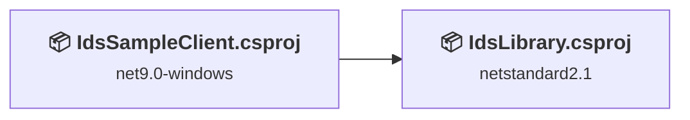
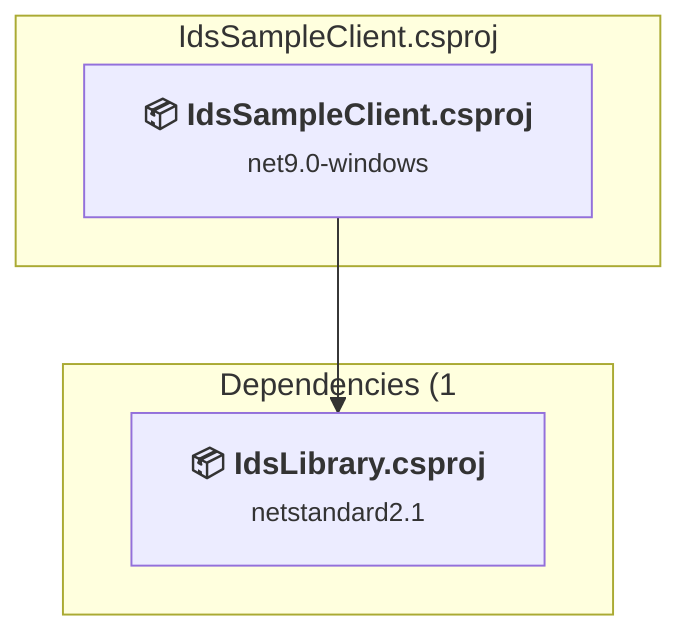
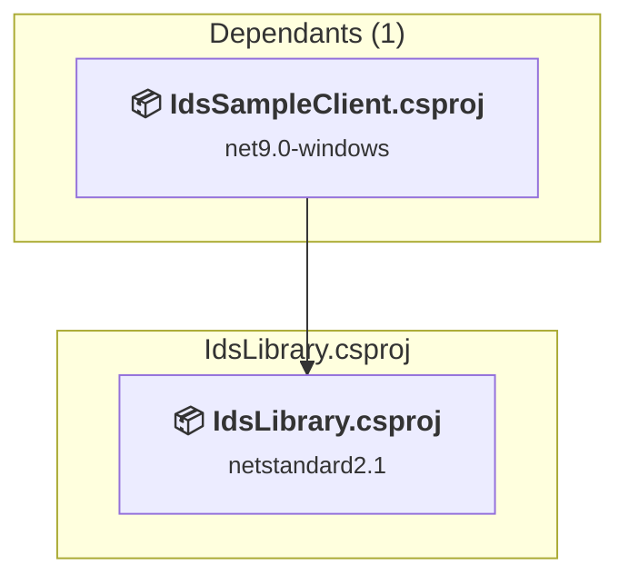

# Projects and dependencies analysis

This document provides a comprehensive overview of the projects and their dependencies in the context of upgrading to .NETCoreApp,Version=v10.0.

## Table of Contents

- [Executive Summary](#executive-Summary)
  - [Highlevel Metrics](#highlevel-metrics)
  - [Projects Compatibility](#projects-compatibility)
  - [Package Compatibility](#package-compatibility)
  - [API Compatibility](#api-compatibility)
- [Aggregate NuGet packages details](#aggregate-nuget-packages-details)
- [Top API Migration Challenges](#top-api-migration-challenges)
  - [Technologies and Features](#technologies-and-features)
  - [Most Frequent API Issues](#most-frequent-api-issues)
- [Projects Relationship Graph](#projects-relationship-graph)
- [Project Details](#project-details)

  - [IdsSampleClient.csproj](#idssampleclientcsproj)
  - [X:\workspaces\dtcrssmd\IDS\Library\IdsLibrary\IdsLibrary.csproj](#x:workspacesdtcrssmdidslibraryidslibraryidslibrarycsproj)

## Executive Summary

### Highlevel Metrics

| Metric | Count | Status |
| :--- | :---: | :--- |
| Total Projects | 2 | All require upgrade |
| Total NuGet Packages | 12 | 3 need upgrade |
| Total Code Files | 35 |  |
| Total Code Files with Incidents | 20 |  |
| Total Lines of Code | 5201 |  |
| Total Number of Issues | 774 |  |
| Estimated LOC to modify | 770+ | at least 14,8% of codebase |

### Projects Compatibility

| Project | Target Framework | Difficulty | Package Issues | API Issues | Est. LOC Impact | Description |
| :--- | :---: | :---: | :---: | :---: | :---: | :--- |
| [IdsSampleClient.csproj](#idssampleclientcsproj) | net9.0-windows | 🟡 Medium | 3 | 729 | 729+ | Wpf, Sdk Style = True |
| [X:\workspaces\dtcrssmd\IDS\Library\IdsLibrary\IdsLibrary.csproj](#x:workspacesdtcrssmdidslibraryidslibraryidslibrarycsproj) | netstandard2.1 | 🟢 Low | 0 | 41 | 41+ | ClassLibrary, Sdk Style = True |

### Package Compatibility

| Status | Count | Percentage |
| :--- | :---: | :---: |
| ✅ Compatible | 9 | 75,0% |
| ⚠️ Incompatible | 1 | 8,3% |
| 🔄 Upgrade Recommended | 2 | 16,7% |
| ***Total NuGet Packages*** | ***12*** | ***100%*** |

### API Compatibility

| Category | Count | Impact |
| :--- | :---: | :--- |
| 🔴 Binary Incompatible | 710 | High - Require code changes |
| 🟡 Source Incompatible | 0 | Medium - Needs re-compilation and potential conflicting API error fixing |
| 🔵 Behavioral change | 60 | Low - Behavioral changes that may require testing at runtime |
| ✅ Compatible | 2901 |  |
| ***Total APIs Analyzed*** | ***3671*** |  |

## Aggregate NuGet packages details

| Package | Current Version | Suggested Version | Projects | Description |
| :--- | :---: | :---: | :--- | :--- |
| Ardalis.SmartEnum | 8.2.0 |  | [IdsLibrary.csproj](#x:workspacesdtcrssmdidslibraryidslibraryidslibrarycsproj) | ✅Compatible |
| AutoMapper | 13.0.1 | 16.1.1 | [IdsSampleClient.csproj](#idssampleclientcsproj) | NuGet package contains security vulnerability |
| DevExpress.Win.Design | 24.2.5 |  | [IdsSampleClient.csproj](#idssampleclientcsproj) | ⚠️NuGet package is incompatible |
| FluentValidation | 11.11.0 |  | [IdsLibrary.csproj](#x:workspacesdtcrssmdidslibraryidslibraryidslibrarycsproj) | ✅Compatible |
| Microsoft.Extensions.Hosting | 9.0.0 | 10.0.8 | [IdsSampleClient.csproj](#idssampleclientcsproj) | NuGet package upgrade is recommended |
| Microsoft.Web.WebView2 | 1.0.2903.40 |  | [IdsSampleClient.csproj](#idssampleclientcsproj) | ✅Compatible |
| Serilog | 4.2.0 |  | [IdsSampleClient.csproj](#idssampleclientcsproj) | ✅Compatible |
| Serilog.Extensions.Hosting | 9.0.0 |  | [IdsSampleClient.csproj](#idssampleclientcsproj) | ✅Compatible |
| Serilog.Settings.Configuration | 9.0.0 |  | [IdsSampleClient.csproj](#idssampleclientcsproj) | ✅Compatible |
| Serilog.Sinks.Console | 6.0.0 |  | [IdsSampleClient.csproj](#idssampleclientcsproj) | ✅Compatible |
| Serilog.Sinks.Debug | 3.0.0 |  | [IdsSampleClient.csproj](#idssampleclientcsproj) | ✅Compatible |
| Serilog.Sinks.File | 6.0.0 |  | [IdsSampleClient.csproj](#idssampleclientcsproj) | ✅Compatible |

## Top API Migration Challenges

### Technologies and Features

| Technology | Issues | Percentage | Migration Path |
| :--- | :---: | :---: | :--- |
| Windows Forms | 709 | 92,1% | Windows Forms APIs for building Windows desktop applications with traditional Forms-based UI that are available in .NET on Windows. Enable Windows Desktop support: Option 1 (Recommended): Target net9.0-windows; Option 2: Add <UseWindowsDesktop>true</UseWindowsDesktop>; Option 3 (Legacy): Use Microsoft.NET.Sdk.WindowsDesktop SDK. |
| Windows Forms Legacy Controls | 1 | 0,1% | Legacy Windows Forms controls that have been removed from .NET Core/5+ including StatusBar, DataGrid, ContextMenu, MainMenu, MenuItem, and ToolBar. These controls were replaced by more modern alternatives. Use ToolStrip, MenuStrip, ContextMenuStrip, and DataGridView instead. |

### Most Frequent API Issues

| API | Count | Percentage | Category |
| :--- | :---: | :---: | :--- |
| T:System.Windows.Forms.GroupBox | 79 | 10,3% | Binary Incompatible |
| T:System.Windows.Forms.TextBox | 53 | 6,9% | Binary Incompatible |
| T:System.Uri | 51 | 6,6% | Behavioral Change |
| T:System.Windows.Forms.Button | 49 | 6,4% | Binary Incompatible |
| T:System.Windows.Forms.Label | 48 | 6,2% | Binary Incompatible |
| P:System.Windows.Forms.Control.Name | 36 | 4,7% | Binary Incompatible |
| T:System.Windows.Forms.Control.ControlCollection | 34 | 4,4% | Binary Incompatible |
| P:System.Windows.Forms.Control.Controls | 34 | 4,4% | Binary Incompatible |
| M:System.Windows.Forms.Control.ControlCollection.Add(System.Windows.Forms.Control) | 34 | 4,4% | Binary Incompatible |
| T:System.Windows.Forms.TabPage | 30 | 3,9% | Binary Incompatible |
| T:System.Windows.Forms.ComboBox | 17 | 2,2% | Binary Incompatible |
| T:System.Windows.Forms.OpenFileDialog | 15 | 1,9% | Binary Incompatible |
| P:System.Windows.Forms.TextBox.Text | 14 | 1,8% | Binary Incompatible |
| M:System.Windows.Forms.Control.ResumeLayout(System.Boolean) | 12 | 1,6% | Binary Incompatible |
| M:System.Windows.Forms.Control.SuspendLayout | 12 | 1,6% | Binary Incompatible |
| T:System.Windows.Forms.TabControl | 12 | 1,6% | Binary Incompatible |
| T:System.Windows.Forms.TreeNodeCollection | 11 | 1,4% | Binary Incompatible |
| P:System.Windows.Forms.TreeNode.Text | 10 | 1,3% | Binary Incompatible |
| T:System.Windows.Forms.ToolTip | 10 | 1,3% | Binary Incompatible |
| T:System.Windows.Forms.SaveFileDialog | 9 | 1,2% | Binary Incompatible |
| T:System.Windows.Forms.TreeNode | 8 | 1,0% | Binary Incompatible |
| P:System.Windows.Forms.TreeNode.Nodes | 7 | 0,9% | Binary Incompatible |
| P:System.Windows.Forms.FileDialog.FileName | 7 | 0,9% | Binary Incompatible |
| M:System.Windows.Forms.ToolTip.SetToolTip(System.Windows.Forms.Control,System.String) | 7 | 0,9% | Binary Incompatible |
| M:System.Windows.Forms.Label.#ctor | 7 | 0,9% | Binary Incompatible |
| T:System.Windows.Forms.AutoScaleMode | 6 | 0,8% | Binary Incompatible |
| P:System.Windows.Forms.GroupBox.TabStop | 6 | 0,8% | Binary Incompatible |
| E:System.Windows.Forms.Control.Click | 6 | 0,8% | Binary Incompatible |
| P:System.Windows.Forms.ButtonBase.UseVisualStyleBackColor | 6 | 0,8% | Binary Incompatible |
| M:System.Windows.Forms.GroupBox.#ctor | 6 | 0,8% | Binary Incompatible |
| M:System.Windows.Forms.TextBox.#ctor | 6 | 0,8% | Binary Incompatible |
| M:System.Windows.Forms.Button.#ctor | 6 | 0,8% | Binary Incompatible |
| T:System.Windows.Forms.DialogResult | 6 | 0,8% | Binary Incompatible |
| T:System.Windows.Forms.ComboBox.ObjectCollection | 5 | 0,6% | Binary Incompatible |
| P:System.Windows.Forms.ComboBox.Items | 5 | 0,6% | Binary Incompatible |
| M:System.Uri.#ctor(System.String) | 5 | 0,6% | Behavioral Change |
| T:System.Xml.Serialization.XmlSerializer | 4 | 0,5% | Behavioral Change |
| P:System.Windows.Forms.TreeNodeCollection.Item(System.Int32) | 4 | 0,5% | Binary Incompatible |
| M:System.Windows.Forms.Form.#ctor | 4 | 0,5% | Binary Incompatible |
| M:System.Windows.Forms.Control.PerformLayout | 4 | 0,5% | Binary Incompatible |
| P:System.Windows.Forms.ComboBox.ObjectCollection.Count | 4 | 0,5% | Binary Incompatible |
| P:System.Windows.Forms.TreeView.Nodes | 3 | 0,4% | Binary Incompatible |
| T:System.Windows.Forms.DockStyle | 3 | 0,4% | Binary Incompatible |
| P:System.Windows.Forms.TabPage.UseVisualStyleBackColor | 3 | 0,4% | Binary Incompatible |
| M:System.Windows.Forms.TabPage.#ctor | 3 | 0,4% | Binary Incompatible |
| M:System.Windows.Forms.Control.Show | 3 | 0,4% | Binary Incompatible |
| P:System.Windows.Forms.TreeNodeCollection.Count | 2 | 0,3% | Binary Incompatible |
| T:System.Windows.Forms.TreeView | 2 | 0,3% | Binary Incompatible |
| T:System.Windows.Forms.ContextMenuStrip | 2 | 0,3% | Binary Incompatible |
| P:System.Windows.Forms.TreeView.SelectedNode | 2 | 0,3% | Binary Incompatible |

## Projects Relationship Graph

Legend:
📦 SDK-style project
⚙️ Classic project

## Project Details

### IdsSampleClient.csproj

#### Project Info

- **Current Target Framework:** net9.0-windows
- **Proposed Target Framework:** net10.0-windows
- **SDK-style**: True
- **Project Kind:** Wpf
- **Dependencies**: 1
- **Dependants**: 0
- **Number of Files**: 19
- **Number of Files with Incidents**: 7
- **Lines of Code**: 1230
- **Estimated LOC to modify**: 729+ (at least 59,3% of the project)

#### Dependency Graph

Legend:
📦 SDK-style project
⚙️ Classic project

### API Compatibility

| Category | Count | Impact |
| :--- | :---: | :--- |
| 🔴 Binary Incompatible | 710 | High - Require code changes |
| 🟡 Source Incompatible | 0 | Medium - Needs re-compilation and potential conflicting API error fixing |
| 🔵 Behavioral change | 19 | Low - Behavioral changes that may require testing at runtime |
| ✅ Compatible | 1197 |  |
| ***Total APIs Analyzed*** | ***1926*** |  |

#### Project Technologies and Features

| Technology | Issues | Percentage | Migration Path |
| :--- | :---: | :---: | :--- |
| Windows Forms Legacy Controls | 1 | 0,1% | Legacy Windows Forms controls that have been removed from .NET Core/5+ including StatusBar, DataGrid, ContextMenu, MainMenu, MenuItem, and ToolBar. These controls were replaced by more modern alternatives. Use ToolStrip, MenuStrip, ContextMenuStrip, and DataGridView instead. |
| Windows Forms | 709 | 97,3% | Windows Forms APIs for building Windows desktop applications with traditional Forms-based UI that are available in .NET on Windows. Enable Windows Desktop support: Option 1 (Recommended): Target net9.0-windows; Option 2: Add <UseWindowsDesktop>true</UseWindowsDesktop>; Option 3 (Legacy): Use Microsoft.NET.Sdk.WindowsDesktop SDK. |

### X:\workspaces\dtcrssmd\IDS\Library\IdsLibrary\IdsLibrary.csproj

#### Project Info

- **Current Target Framework:** netstandard2.1✅
- **SDK-style**: True
- **Project Kind:** ClassLibrary
- **Dependencies**: 0
- **Dependants**: 1
- **Number of Files**: 23
- **Number of Files with Incidents**: 13
- **Lines of Code**: 3971
- **Estimated LOC to modify**: 41+ (at least 1,0% of the project)

#### Dependency Graph

Legend:
📦 SDK-style project
⚙️ Classic project

### API Compatibility

| Category | Count | Impact |
| :--- | :---: | :--- |
| 🔴 Binary Incompatible | 0 | High - Require code changes |
| 🟡 Source Incompatible | 0 | Medium - Needs re-compilation and potential conflicting API error fixing |
| 🔵 Behavioral change | 41 | Low - Behavioral changes that may require testing at runtime |
| ✅ Compatible | 1704 |  |
| ***Total APIs Analyzed*** | ***1745*** |  |

#### Project Package References

| Package | Type | Current Version | Suggested Version | Description |
| :--- | :---: | :---: | :---: | :--- |
| Ardalis.SmartEnum | Explicit | 8.2.0 |  | ✅Compatible |
| FluentValidation | Explicit | 11.11.0 |  | ✅Compatible |

